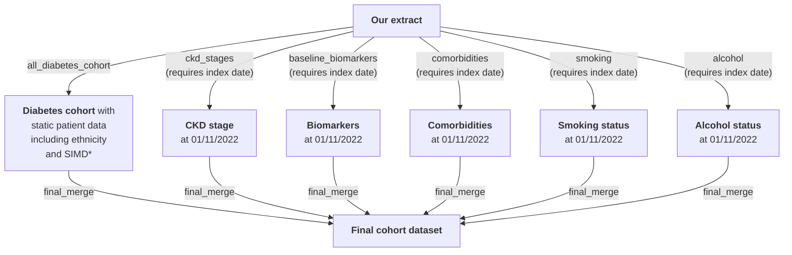

# Prevalent cohort

The prevalent cohort consists of those actively registered on 01/11/2022 (the index date) who have a diabetes diagnosis before/on this date, and who have linked HES records, with added biomarker/comorbidity/sociodemographic/medication info at this date.

&nbsp;

## Script overview

The below diagram shows the R scripts (in grey boxes) used to create the prevalent cohort.

\*SIMD=Scottish Index of Multiple Deprivation; 'static' using the 2016 data. SIMD is coded as 1=most deprived, 10=least deprived. This differs from England deprivation score, where 1=least deprived, 10=most deprived. Two variables have been created: simd_decile (scottish version), imd_decile (translation of scottish to english).

The scripts shown in the above diagram (in grey boxes) can be found in this directory, except those which are common to the other cohorts (all_diabetes_cohort) which are in the upper directory of this repository.

&nbsp;

## Script details

| Script description | &nbsp;&nbsp;&nbsp;&nbsp;&nbsp;&nbsp;&nbsp;&nbsp;&nbsp;&nbsp;&nbsp;&nbsp;&nbsp;&nbsp;&nbsp;&nbsp;&nbsp;&nbsp;&nbsp;&nbsp;&nbsp;&nbsp;&nbsp;&nbsp;&nbsp;&nbsp;&nbsp;&nbsp;&nbsp;&nbsp;&nbsp;&nbsp;&nbsp;&nbsp;Outputs&nbsp;&nbsp;&nbsp;&nbsp;&nbsp;&nbsp;&nbsp;&nbsp;&nbsp;&nbsp;&nbsp;&nbsp;&nbsp;&nbsp;&nbsp;&nbsp;&nbsp;&nbsp;&nbsp;&nbsp;&nbsp;&nbsp;&nbsp;&nbsp;&nbsp;&nbsp;&nbsp;&nbsp;&nbsp;&nbsp;&nbsp;&nbsp;&nbsp;&nbsp; |
| ---- | ---- |
| **all_diabetes_cohort**: table of patids meeting the criteria for our mixed Type 1/Type 2/'other' diabetes cohort plus additional patient variables | **all_diabetes_cohort**: 1 row per patid of those in the diabetes cohort, with diabetes diagnosis dates, DOB, gender, ethnicity etc. |
|**at_diag_baseline_biomarkers**: pulls biomarkers value at cohort index dates | **at_diag_baseline_biomarkers**: 1 row per patid (as there are no patids with >1 index date) with all biomarker values at index date where available (including HbA1c and height) |
|**at_diag_ckd_stages**: finds onset of CKD stages relative to cohort index dates | **at_diag_ckd_stages**: 1 row per patid (as there are no patids with >1 index date) with baseline CKD stage at index date where available |
|**at_diag_comorbidities**: finds onset of comorbidities relative to cohort index dates | **at_diag_comorbidities**:  1 row per patid (as there are no patids with >1 index date) with earliest pre-index date code occurrence, latest pre-index date code occurrence, and earliest post-index date code occurrence |
|**at_diag_smoking**: finds smoking status at cohort index dates | **at_diag_smoking**: 1 row per patid (as there are no patids with >1 index date) with smoking status and QRISK2 smoking category at index date where available |
|**at_diag_alcohol**: finds alcohol status at cohort index dates | **at_diag_alcohol**: 1 row per patid (as there are no patids with >1 index date) with alcohol status at index date where available |
|**at_diag_final_merge**: brings together variables from all of the above tables | **at_diag_final_merge**: 1 row per patid -(as there are no patids with >1 index date) with relevant biomarker/comorbidity/smoking/alcohol variables |

&nbsp;

## Data dictionary of variables in 'at_diag_final_merge' table

Biomarkers included: HbA1c (mmol/mol), weight (kg), height (m), BMI (kg/m2), fasting glucose (mmol/L), HDL (mmol/L), triglycerides (mmol/L), blood creatinine (umol/L), LDL (mmol/L), ALT (U/L), AST (U/L), total cholesterol (mmol/L), DBP (mmHg), SBP (mmHg), ACR (mg/mmol / g/mol). NB: BMI is from BMI codes only, not calculated from weight+height.

Comorbidities included: atrial fibrillation, angina (overall and specifically unstable angina recorded in hospital), anxiety, asthma, benign prostate hyperplasia, bronchiectasis, CKD stage 5/ESRD, CLD, COPD, cystic fibrosis, dementia, diabetic nephropathy, DKA (hospital data only), falls, family history of diabetes, family history of premature cardiovascular disease, mild/moderate/severe frailty, haematological cancers, heart failure, major and minor amputations in hospital (doesn't only include primary cause), hypertension (uses primary care data only, see note in script), IHD, lower limb fracture, myocardial infarction (overall and more specifically in hospital with a reduced codelists: 'incident_mi'), neuropathy, osteoporosis, other neurological conditions, PAD, photocoagulation therapy (hospital data only), pulmonary fibrosis, pulmonary hypertension, retinopathy, (coronary artery) revascularisation, rhematoid arthritis, solid cancer, solid organ transplant, stroke (overall and more specifically in hospital with a reduced codelists: 'incident_stroke'), TIA, vitreous haemorrhage (hospital data only), 'primary_hhf' (hospitalisation for HF with HF as primary cause), 'primary_incident_mi' (hospitalisation for MI with MI as primary cause using incident_mi codelist), 'primary_incident_stroke' (hospitalisation for stroke with stroke as primary cause using incident_stroke codelist), osmotic symptoms (micturition control, volume depletion, urinary frequency).

| Variable name | Description | Notes on derivation |
| --- | --- | --- |
| patid | unique patient identifier | |
| index_date | index date (e.g. diagnosis date for 'at-diagnosis' cohort, 01/02/2020 for prevalent cohort, drug start date for treatment response cohort) | |
| gender | gender (1=male, 2=female) | |
| dob | date of birth | if month and date missing, 1st July used, if date but not month missing, 15th of month used, or earliest medcode in year of birth if this is earlier |
| ethnicity_5cat | 5-category ethnicity: (0=White, 1=South Asian, 2=Black, 3=Other, 4=Mixed) | |
| simd_decile | 2016 Scottish Index of Multiple Deprivation (SIMD) decile (1=most deprived, 10=least deprived) || 
| imd_decile | Swap of SIMD to English Index of Multiple Deprivation (IMD) decile (1=least deprived, 10=most deprived) | |
| dm_diag_age_all | age at diabetes diagnosis | dm_diag_date_all - dob NB: as at-diagnosis cohort excludes those with diagnosis dates before registration start, this variable is missing and only dm_diag_age (below) is present See above note next to dm_diag_date_all variable on young diagnosis in T2Ds |
| diabetes_type | diabetes type | (1=Type 1, 2=Type 2) |
| pre{biomarker} | biomarker value at baseline | For all biomarkers except HbA1c: pre{biomarker} is closest biomarker to index date within window of -730 days (2 years before index date) and +7 days (a week after index date)  For HbA1c: prehba1c is closest HbA1c to index date within window of -183 days (6 months before index date) and +7 days (a week after index date) |
| pre{biomarker}date | date of baseline biomarker | |
| pre{biomarker}datediff | days between index date and baseline biomarker (negative: biomarker measured before index date) | |
| height | height in cm | Mean of all values on/post-index date |
| preckdstage | CKD stage at baseline | CKD stages calculated as per [our algorithm](https://github.com/Exeter-Diabetes/CPRD-Codelists#ckd-chronic-kidney-disease-stage) eGFR calculated from creatinine using CKD-EPI creatinine 2021 equation Start date = earliest test for CKD stage, only including those confirmed by another test at least 91 days later, without a test for a different stage in the intervening period Baseline stage = maximum stage with start date < index date or up to 7 days afterwards CKD5 supplemented by medcodes/ICD10/OPCS4 codes for CKD5 / ESRD |
| preckdstagedate | date of onset of baseline CKD stage (earliest test for this stage) | |
| preckdstagedatediff | days between index date and preckdstagedate | |
| pre_index_date_earliest_{comorbidity} | earliest occurrence of comorbidity before/at index date | |
| pre_index_date_latest_{comorbidity} | latest occurrence of comorbidity before/at index date | |
| pre_index_date_{comorbidity} | binary 0/1 if any instance of comorbidity before/at index date | |
| post_index_date_first_{comorbidity} | earliest occurrence of comorbidity after (not at) index date | |
| smoking_cat | Smoking category at index date: Non-smoker, Ex-smoker or Active smoker | |
| alcohol_cat | Alcohol consumption category at index date: None, Within limits, Excess or Heavy |  |
| primary_death_cause1 | primary death cause from National Records of Scotland Death data (ICD10) |  | 
| secondary_death_cause1-17 | secondary death cases from National Records of Scotland Death data (ICD10) | | 
| cv_death_primary_cause | 1 if primary cause of death is CV | | 
| cv_death_any_cause | 1 if any (primary or secondary) cause of death is CV | | 
| hf_death_primary_cause | 1 if primary cause of death is heart failure | |
| hf_death_any_cause | 1 if any (primary or secondary) cause of death is heart failure | | 
| kf_death_primary_cause | 1 if primary cause of death is kidney failure | |
| kf_death_any_cause | 1 if any (primary or secondary) cause of death is kidney failure | |
